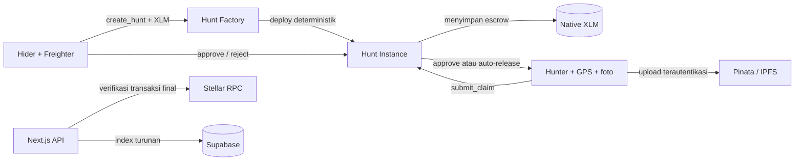
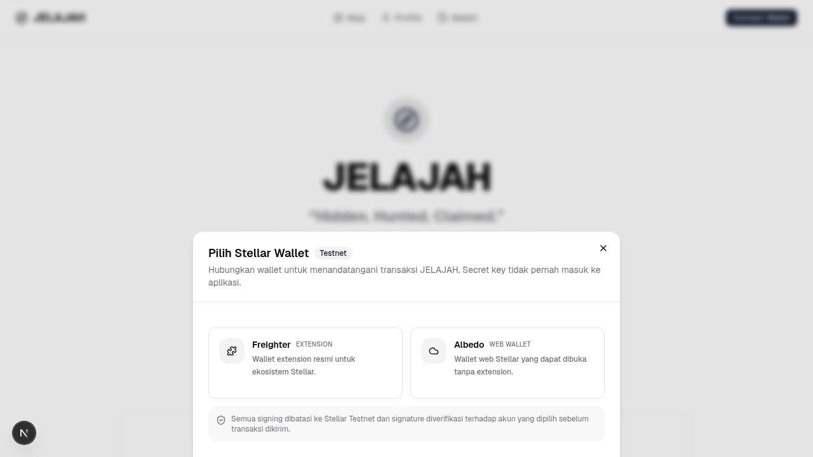
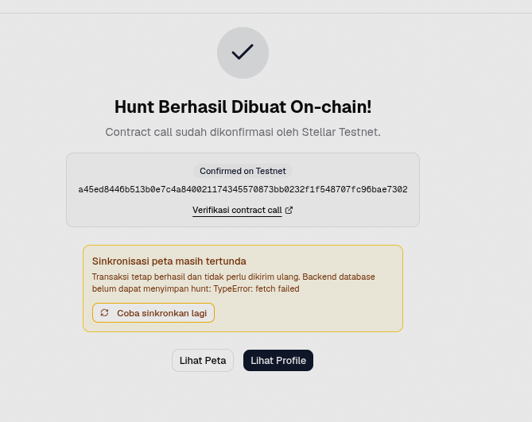
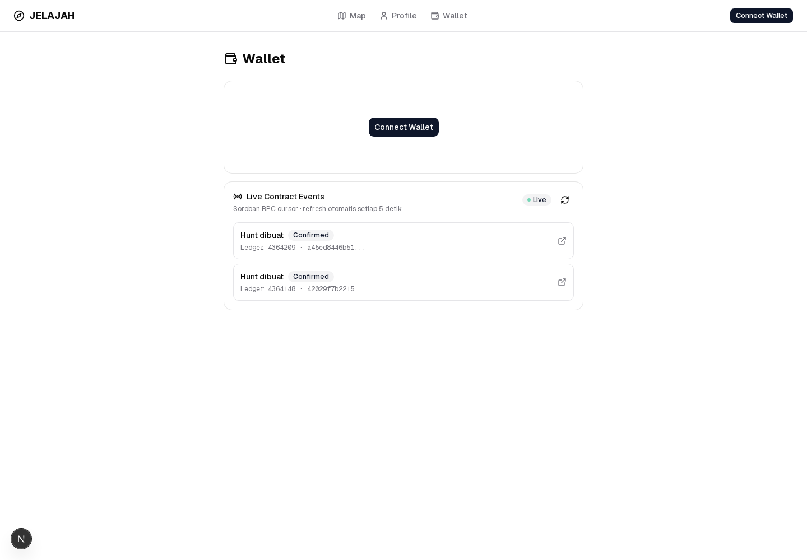

# JELAJAH — Hidden. Hunted. Claimed.

> Platform treasure hunt dunia nyata di Stellar. Hider mengunci reward native XLM di escrow, hunter mencari lokasi dan mengirim bukti, lalu reward dibayarkan melalui smart contract.

[](https://nextjs.org/)
[](https://react.dev/)
[](https://stellar.org/)
[](https://supabase.com/)
[](.github/workflows/ci.yml)

JELAJAH menggabungkan eksplorasi lokasi, foto bukti IPFS, wallet Freighter, dan escrow Soroban. Versi yang aktif saat ini adalah **MVP Level 2: GPS Hunt di Stellar Testnet**.

## Status MVP

| Area | Status |
|---|---|
| GPS Hunt create, claim, approve, dan reject | Siap di Testnet |
| Escrow native XLM per hunt | Siap di Testnet |
| Auto-release setelah 24 jam | Terimplementasi dan teruji |
| Refund hunt kedaluwarsa | Terimplementasi dan teruji |
| Wallet signed session | Terimplementasi |
| Native XLM payment dengan Freighter | Terimplementasi |
| Foto bukti IPFS melalui Pinata | Terimplementasi |
| Index transaksi terverifikasi ke Supabase | Terimplementasi |
| Quest, dispute, race, puzzle, dan photo hunt | Roadmap; belum aktif |
| Mainnet | Belum |

> JELAJAH masih software Testnet. Jangan gunakan aset bernilai nyata sebelum audit independen dan migrasi Mainnet selesai.

## Cara Kerja



Alur utamanya:

1. Hider login dengan menandatangani challenge menggunakan Freighter.
2. Hider membuat GPS Hunt dan menyetujui pemindahan XLM ke instance escrow.
3. Hunter membuka hunt dari peta, masuk radius, lalu mengunggah foto bukti.
4. Hunter menandatangani transaksi `submit_claim`.
5. Hider memilih approve atau reject. Jika tidak merespons selama 24 jam, claim dapat di-auto-release.
6. Database hanya menjadi index turunan setelah server memverifikasi transaksi final dari Stellar RPC.

## Level 1 Submission

| Requirement | Implementasi | Status |
|---|---|---|
| Freighter wallet pada Stellar Testnet | Network diperiksa saat connect/restore | Siap |
| Connect dan disconnect | Wallet provider + signed session | Siap |
| Fetch dan tampilkan XLM balance | Horizon account balance pada halaman Wallet | Siap |
| Kirim native XLM | Classic payment melalui Freighter + Horizon | Siap |
| Feedback sukses/gagal | Status eksplisit, pesan error, dan loading state | Siap |
| Transaction result | Full hash dan link Stellar Expert Testnet | Siap |
| Minimum 10 meaningful commits | Lebih dari 40 commit | Siap |
| Public repository dan README | Root README tersedia | Siap setelah push |

### Level 1 Evidence

| Wallet connected + balance | Successful payment + transaction result |
|---|---|
|  |  |
|  |  |

Verified transaction: [`f960ed9e734dbe1051430051f366c4af19d9bc0e000d6029e7890dce6c4684a0`](https://stellar.expert/explorer/testnet/tx/f960ed9e734dbe1051430051f366c4af19d9bc0e000d6029e7890dce6c4684a0)

- Network: Stellar Testnet
- Operation: native XLM payment
- Amount: `1.0000000 XLM`
- Memo: `JELAJAH Level 1`
- Status: successful, ledger `4351946`

Seluruh screenshot berasal dari wallet dan transaksi Testnet nyata, bukan mock data.

## Level 2 Submission

| Requirement | Implementasi | Status |
|---|---|---|
| Multi-wallet | Freighter extension dan Albedo web wallet | Siap |
| Tiga atau lebih jenis error | Wallet/network, simulation/contract, RPC/confirmation, IPFS, dan database indexing | Siap |
| Contract deployed di Testnet | GPS Hunt Factory aktif dan dapat diverifikasi | Siap |
| Contract dipanggil dari frontend | `create_hunt` ditandatangani wallet dan dikirim dari wizard | Siap |
| Transaction status visible | Fase prepare, sign, submit, confirmation, hasil, hash, dan link explorer | Siap |
| Real-time event integration | Polling cursor Soroban RPC setiap 5 detik dengan deduplikasi dan retry | Siap |
| Minimum 10 meaningful commits | Lebih dari 40 commit sebelum penambahan Level 2 | Siap |

### Level 2 Evidence

| Multi-wallet options | Successful frontend contract call |
|---|---|
|  |  |



- Deployed factory: [`CA4YH5KFC5JBT6ISKCG42VU4PNN6EAAE245CLMOZTJDSIEGDRA4IQR55`](https://stellar.expert/explorer/testnet/contract/CA4YH5KFC5JBT6ISKCG42VU4PNN6EAAE245CLMOZTJDSIEGDRA4IQR55)
- Verified frontend contract call: [`a45ed8446b513b0e7c4a840021174345570873bb0232f1f548707fc96bae7302`](https://stellar.expert/explorer/testnet/tx/a45ed8446b513b0e7c4a840021174345570873bb0232f1f548707fc96bae7302)
- Network result: `SUCCESS`, ledger `4364209`, method `create_hunt`
- Live integration proof: the `hunt_created` event for the same hash is displayed by the wallet event feed.

The Stellar ledger is the canonical source of transaction success. Supabase indexing is an idempotent, retryable secondary step, so an unavailable database never causes the UI to resend an already-confirmed escrow transaction.

## Tampilan

| Landing | Map |
|---|---|
|  |  |

| Create Hunt | Mobile Map |
|---|---|
|  |  |

## Tech Stack

| Layer | Teknologi |
|---|---|
| Web | Next.js 16.3.3, React 19, TypeScript 5 |
| UI | Tailwind CSS 4, Base UI, Lucide |
| Map | Leaflet dan OpenStreetMap |
| Wallet | Freighter API dan Albedo |
| Blockchain | Stellar Testnet, Soroban SDK 27.0.2 |
| Contracts | Rust/WASM: factory, instance, reputation, dispute, quest-chain |
| Database | Supabase PostgreSQL dengan Row Level Security |
| Storage | Pinata/IPFS |
| Testing | Rust unit/integration tests dan Playwright |

## Deployment Stellar Testnet

| Komponen | Address / hash |
|---|---|
| GPS Hunt Factory | [`CA4YH5KFC5JBT6ISKCG42VU4PNN6EAAE245CLMOZTJDSIEGDRA4IQR55`](https://stellar.expert/explorer/testnet/contract/CA4YH5KFC5JBT6ISKCG42VU4PNN6EAAE245CLMOZTJDSIEGDRA4IQR55) |
| Hunt Instance WASM SHA-256 | `eee91c39c3700c63ad7a329738721b49a50722d9a000054ad876dca51d12dfce` |
| Native XLM SAC | `CDLZFC3SYJYDZT7K67VZ75HPJVIEUVNIXF47ZG2FB2RMQQVU2HHGCYSC` |
| Live smoke-test instance | [`CCEX3DHRPFWFTDDTHPUJT7ZX7V2LZK53LLB477EDSNRTCQJELQZU3TRA`](https://stellar.expert/explorer/testnet/contract/CCEX3DHRPFWFTDDTHPUJT7ZX7V2LZK53LLB477EDSNRTCQJELQZU3TRA) |

Smoke test final: create hunt dengan escrow 1 XLM → claim dari akun kedua → approve oleh hider → status `Claimed` → saldo escrow `0`.

## Menjalankan Secara Lokal

### Prasyarat

- Node.js 20.9 atau lebih baru
- npm 10 atau lebih baru
- Freighter Wallet pada jaringan Testnet
- Project Supabase
- Akun Pinata untuk upload bukti
- Rust dan target `wasm32v1-none` jika ingin membangun contract

### 1. Instal aplikasi web

```bash
git clone https://github.com/Faiz-abdurrachman/jelajah.git
cd jelajah/apps/web
npm ci
cp .env.example .env.local
```

### 2. Isi environment

Gunakan address Testnet di atas dan credential milik sendiri:

```env
NEXT_PUBLIC_NETWORK=testnet
NEXT_PUBLIC_RPC_URL=https://soroban-testnet.stellar.org
NEXT_PUBLIC_HORIZON_URL=https://horizon-testnet.stellar.org
NEXT_PUBLIC_NETWORK_PASSPHRASE=Test SDF Network ; September 2015

NEXT_PUBLIC_HUNT_FACTORY=CA4YH5KFC5JBT6ISKCG42VU4PNN6EAAE245CLMOZTJDSIEGDRA4IQR55
NEXT_PUBLIC_HUNT_INSTANCE_WASM_HASH=eee91c39c3700c63ad7a329738721b49a50722d9a000054ad876dca51d12dfce
NEXT_PUBLIC_XLM_ASSET_CONTRACT=CDLZFC3SYJYDZT7K67VZ75HPJVIEUVNIXF47ZG2FB2RMQQVU2HHGCYSC
NEXT_PUBLIC_CURRENT_LEVEL=2

NEXT_PUBLIC_SUPABASE_URL=<project-url>
NEXT_PUBLIC_SUPABASE_ANON_KEY=<publishable-or-anon-key>
SUPABASE_SERVICE_ROLE_KEY=<server-secret-key>
WALLET_SESSION_SECRET=<random-minimum-32-characters>

PINATA_API_KEY=<server-only-api-key>
PINATA_SECRET_KEY=<server-only-secret-key>
IPFS_GATEWAY=https://gateway.pinata.cloud
```

Jangan menambahkan prefix `NEXT_PUBLIC_` pada service-role/secret key, Pinata credential, atau wallet session secret. Jangan commit `.env.local`.

Untuk membuat wallet session secret:

```bash
openssl rand -hex 32
```

### 3. Siapkan database

Untuk project Supabase yang sudah ada, jalankan migration berikut melalui workflow migration Supabase atau SQL Editor:

```text
apps/web/lib/supabase/migrations/001_secure_gps_mvp.sql
```

Migration tersebut menambah field canonical chain, mengaktifkan RLS, dan menolak mutation langsung dari role `anon`/`authenticated`. File `seed.sql` hanya berisi data demo legacy dan tidak boleh dijalankan di production.

### 4. Jalankan aplikasi

```bash
cd apps/web
npm run dev
```

Buka `http://localhost:3000`, sambungkan Freighter, pilih jaringan Testnet, lalu isi akun melalui Friendbot jika dibutuhkan.

## Testing dan Quality Gates

### Web

```bash
cd apps/web
npx tsc --noEmit
npx eslint . --max-warnings=0
npm audit --omit=dev --audit-level=high
npm run build
npm run test:e2e
```

Status terakhir: typecheck, lint, production build, dependency audit, dan **23/23 Playwright tests** lulus.

### Smart contracts

```bash
cd contracts
cargo test --workspace --locked
cargo build -p hunt-instance --target wasm32v1-none --release --locked
cargo test -p hunt-factory --features factory-integration --locked
```

Status terakhir: **8 state-machine tests**, **1 reputation test**, dan **3 factory integration tests** lulus.

GitHub Actions menjalankan dependency audit, typecheck, lint, production build, Playwright, contract check, build WASM, dan factory integration test pada push atau pull request ke `main`.

## Struktur Repository

```text
jelajah/
├── apps/web/                       Next.js web app dan Route Handlers
│   ├── app/api/                    Wallet auth, hunt, claim, resolve, IPFS
│   ├── components/                 UI, hunt flow, map, wallet provider
│   ├── e2e/                        Playwright browser/API security tests
│   └── lib/                        Stellar, Supabase, IPFS, auth helpers
├── contracts/
│   ├── hunt-factory/               Deploy instance dan transfer escrow
│   ├── hunt-instance/              GPS Hunt state machine dan payout
│   ├── reputation/                 XP/reputation prototype
│   ├── dispute/                    Roadmap L3
│   └── quest-chain/                Roadmap L3
├── docs/                            Product dan technical documentation
└── .github/workflows/ci.yml         CI web dan contracts
```

## Security Model

- Wallet ownership diverifikasi melalui signed challenge dan cookie session `HttpOnly`.
- Server membaca envelope transaksi yang sudah final dan memeriksa contract, method, argumen, address wallet, dan metadata hash.
- Service key Supabase dan credential Pinata hanya digunakan server-side.
- Direct database write dari browser ditolak; chain adalah sumber status ekonomi yang canonical.
- Retry setelah transaksi berhasil hanya mengulang indexing database, bukan mengirim transaksi baru.

### Batas kepercayaan GPS

Soroban tidak dapat membuktikan sensor GPS browser. Koordinat claim adalah pernyataan on-chain yang ditandatangani hunter, sedangkan foto dan keputusan hider menjadi lapisan verifikasi. MVP ini bukan GPS oracle dan belum sepenuhnya trustless.

Sebelum Mainnet dibutuhkan attestation/oracle lokasi, dispute yang benar-benar mengendalikan escrow, rate limiting, observability, backup/recovery, dan audit independen.

## Checklist Operasional Wajib

- [ ] Terapkan `001_secure_gps_mvp.sql` ke project Supabase.
- [ ] Ganti legacy/leaked `service_role` dengan Secret API Key baru.
- [ ] Pasang `WALLET_SESSION_SECRET` yang terpisah di development dan hosting.
- [ ] Pasang credential Pinata hanya pada server environment.
- [ ] Jalankan seluruh quality gates sebelum deploy.
- [ ] Pastikan Freighter menggunakan Stellar Testnet.

## Roadmap

| Level | Fokus | Status |
|---|---|---|
| L1 | Landing, wallet, map, profile | Selesai |
| L2 | GPS Hunt dan XLM escrow | MVP Testnet selesai |
| L3 | Quest chain, verifier, dispute dan appeal | Direncanakan |
| L4 | Brand campaigns dan leaderboard | Direncanakan |
| L5 | Community, streak, badges | Direncanakan |
| L6 | Mainnet dan independent security audit | Direncanakan |
| L7 | API/SDK dan enterprise | Direncanakan |

## Dokumentasi

| Dokumen | Isi |
|---|---|
| [Product Requirements](docs/01-prd.md) | Visi produk dan requirement |
| [Game Rules](docs/02-game-rules.md) | Aturan permainan |
| [Technical Architecture](docs/03-technical-architecture.md) | Arsitektur sistem |
| [Smart Contract Specification](docs/04-smart-contract-spec.md) | Spesifikasi contract |
| [User Flows](docs/05-user-flow-screens.md) | Alur dan layar pengguna |
| [Economics](docs/06-economics.md) | Reward dan model ekonomi |
| [Belt Submission Guide](docs/07-belt-submission-guide.md) | Checklist challenge |
| [Scale Architecture](docs/08-scale-architecture.md) | Rencana skalabilitas |
| [Security & Operations](docs/09-security-and-operations.md) | Security boundary dan deployment |

## Kontributor

Dibangun oleh **Faiz Abdurrachman** untuk Stellar Belt Challenge.
