# JELAJAH — Hidden. Hunted. Claimed.

> Real-world treasure hunt platform di **Stellar blockchain**. MVP L2 saat ini mendukung GPS Hunt dengan escrow native XLM, bukti foto IPFS, approval hider, dan auto-release 24 jam.

[](https://www.typescriptlang.org/)
[](https://nextjs.org/)
[](https://react.dev/)
[](https://tailwindcss.com/)
[](https://stellar.org/)
[](https://supabase.com/)

---

## 📸 Screenshots

> Screenshots diambil di Stellar Testnet.

| Landing Page | Map (OpenStreetMap) |
|---|---|
| 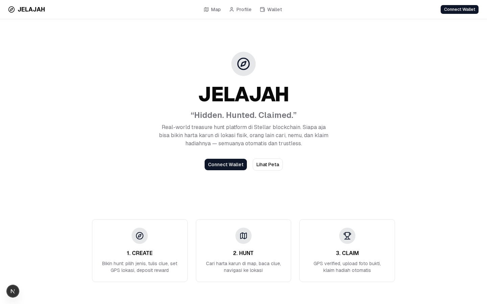 | 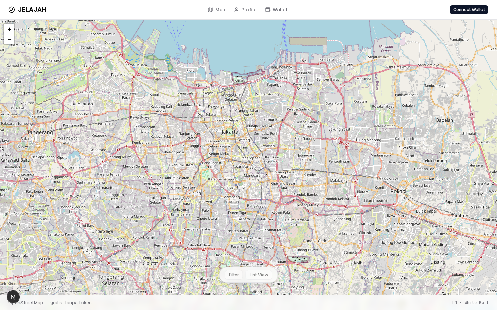 |

| Hunt Create Wizard | Leaderboard |
|---|---|
| 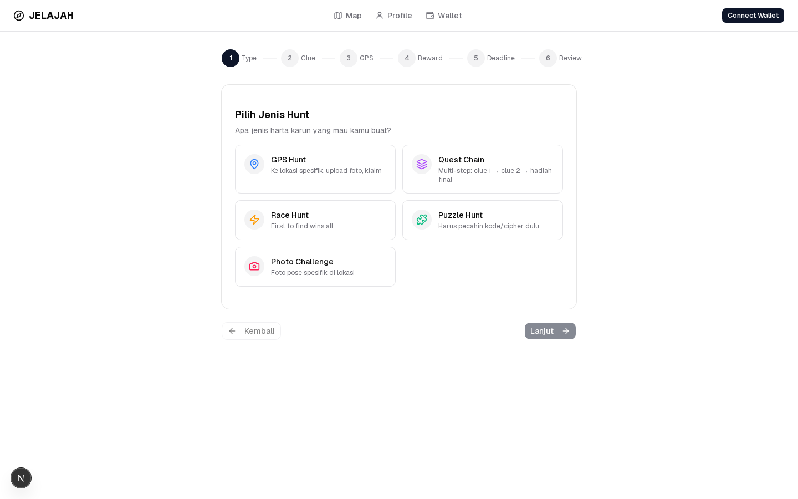 |  |

| Community Feed | Profile |
|---|---|
| 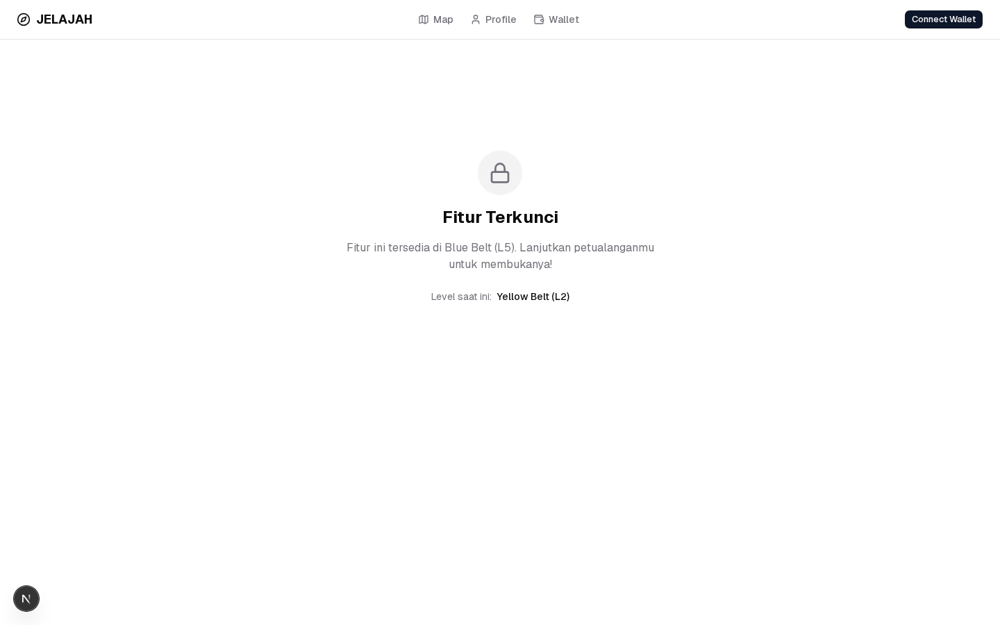 | 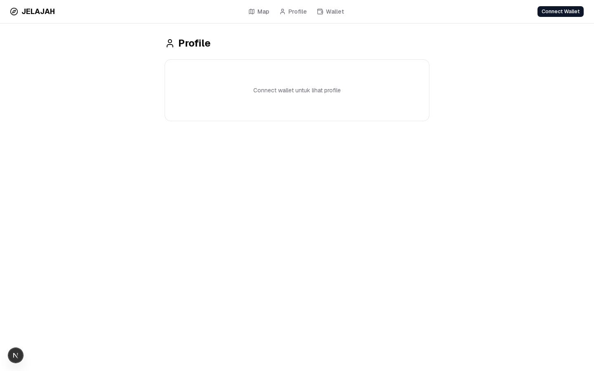 |

| Wallet Connect Prompt | How It Works |
|---|---|
| 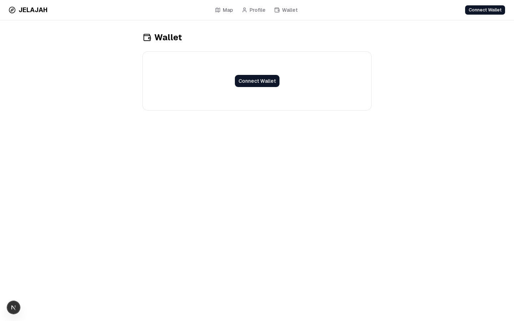 |  |

### 📱 Mobile Responsive

| Mobile Landing | Mobile Map | Mobile Hunt Create |
|---|---|---|
| 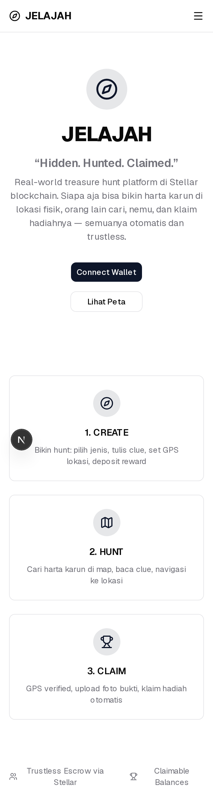 | 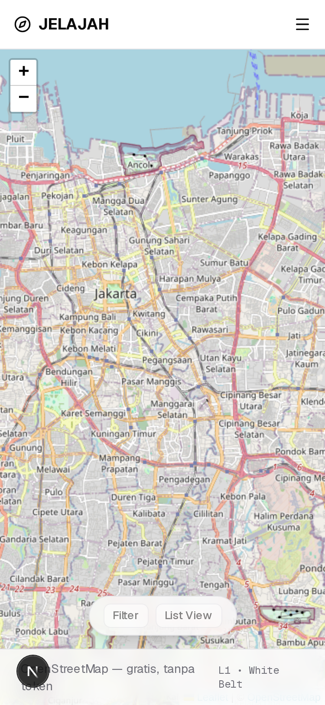 | 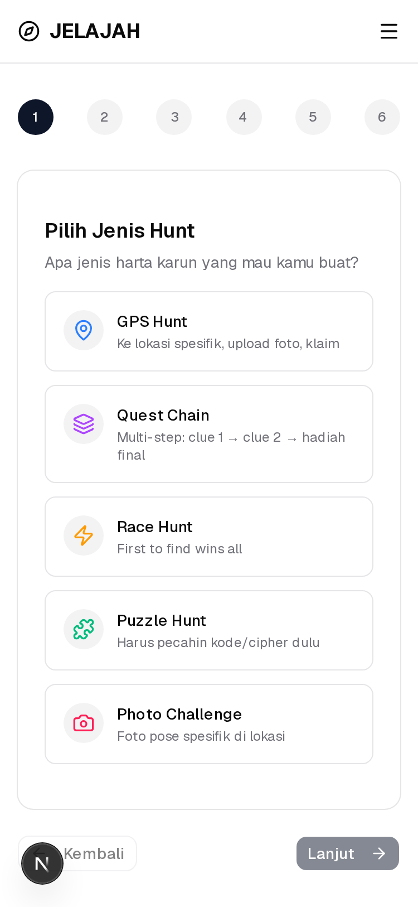 |

| Mobile Leaderboard | Mobile Profile | Mobile Community |
|---|---|---|
|  | 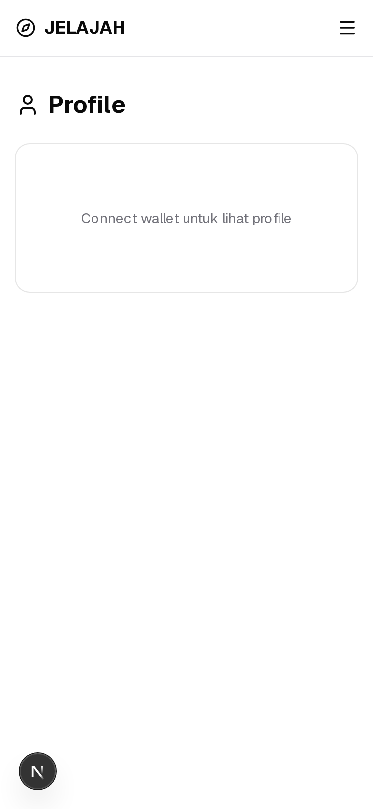 | 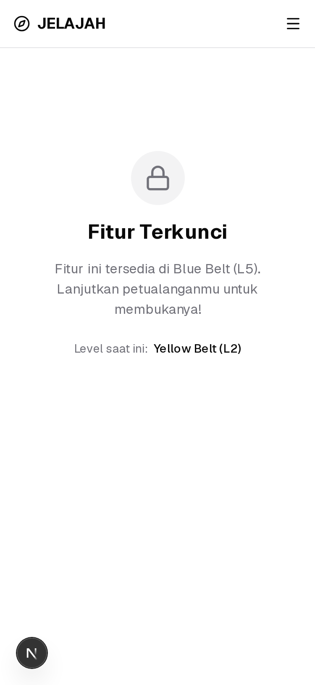 |

---

## 🧪 E2E Tests

```
Running 18 tests using 4 workers
  ✅ Landing Page — page loads with title and CTA
  ✅ Landing Page — how it works section renders
  ✅ Landing Page — Lihat Peta button navigates to map
  ✅ Map Page — page loads and renders map container
  ✅ Map Page — navbar is visible on map page
  ✅ Map Page — leaflet tiles load
  ✅ Hunt Create Flow — create hunt page loads and wizard renders
  ✅ Hunt Create Flow — hanya GPS aktif; tipe yang belum selesai terkunci
  ✅ Hunt Create Flow — navigation buttons present
  ✅ Hunt Detail Page — hunt detail page renders for a hunt ID

  ✅ Wallet API — challenge HttpOnly dan validasi address
  ✅ Wallet API — mutation tanpa session ditolak
  ✅ XLM Payment — valid native payment input
  ✅ XLM Payment — invalid destination dan amount ditolak
  ✅ XLM Payment — memo byte limit
  ✅ XLM Payment — form dilindungi wallet connection
  ✅ XLM Payment — Horizon failure menjadi feedback actionable

  18 passed
```

Run: `npm run test:e2e`

---

## ⚙️ CI/CD

**GitHub Actions** pipeline: `.github/workflows/ci.yml`

```yaml
jobs:
  web: npm ci → dependency audit → typecheck → lint → build → Playwright
  contracts: cargo check → 8 state-machine tests → build WASM → 3 factory integration tests
```

---

## 🔗 Contract Verification

**Transaction Hash** (reputation contract — `add_xp` call on Testnet):

```
0d450bbf2a2a13896866c15215f894eb345d017e467d333ee98025cbf1d566b2
```

🔗 [View on Stellar Expert](https://stellar.expert/explorer/testnet/tx/0d450bbf2a2a13896866c15215f894eb345d017e467d333ee98025cbf1d566b2)

---

## 🎯 Core Loop

```
CREATE → HIDE → HUNT → CLAIM → REPEAT
```

| Step | Actor | Detail |
|---|---|---|
| **CREATE** | Hider | Bikin hunt: pilih jenis, set clue, GPS lokasi, upload foto, set reward + deadline |
| **HIDE** | Smart Contract | Native XLM dipindahkan atomik ke escrow contract per hunt |
| **HUNT** | Hunter | Lihat map, baca clue, navigasi ke lokasi |
| **CLAIM** | Hunter | GPS verified → upload foto bukti → hider approve / auto cair 24 jam |

## 🥋 Level 1 Submission Evidence

Halaman Wallet menyediakan connect/disconnect, XLM balance dari Horizon, serta classic native XLM payment yang ditandatangani Freighter. Hasil transaksi menampilkan status sukses/gagal, full transaction hash, dan link Stellar Expert Testnet.

| Wallet connected | XLM balance |
|---|---|
| 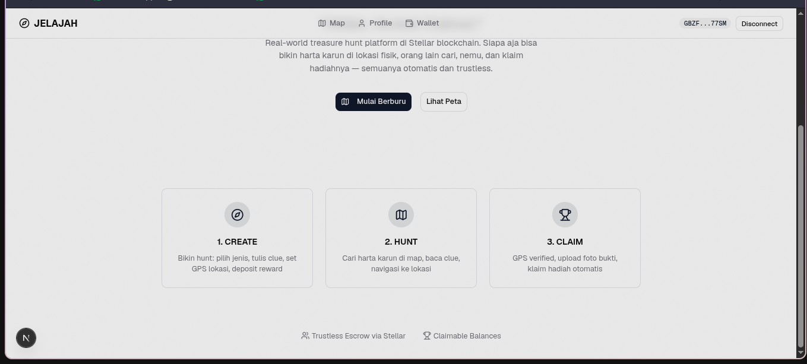 | 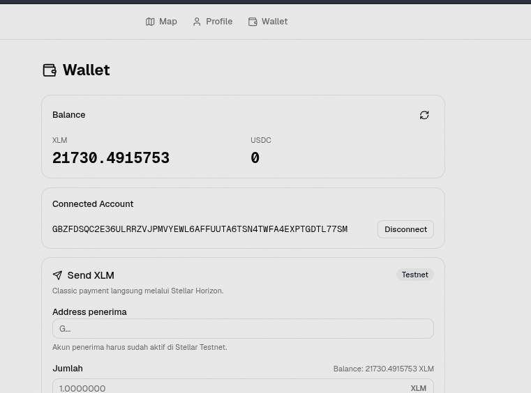 |

| Payment success | Stellar Expert result |
|---|---|
| 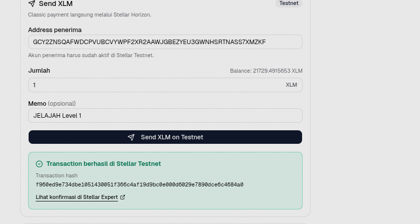 | 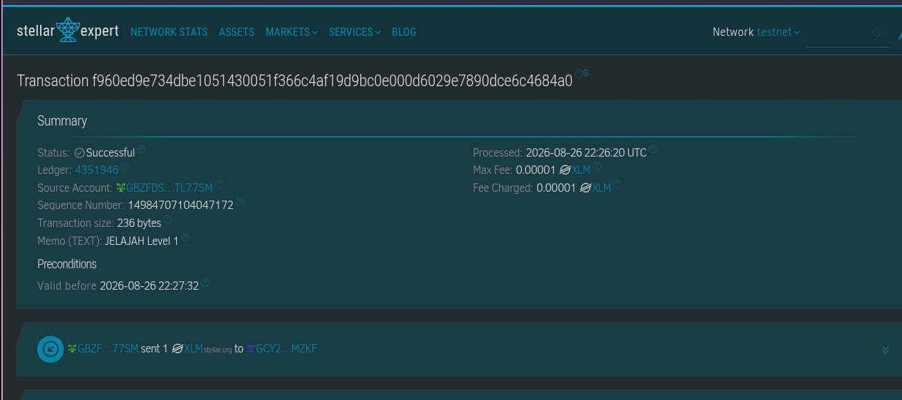 |

Verified Testnet transaction: [`f960ed9e734dbe1051430051f366c4af19d9bc0e000d6029e7890dce6c4684a0`](https://stellar.expert/explorer/testnet/tx/f960ed9e734dbe1051430051f366c4af19d9bc0e000d6029e7890dce6c4684a0). Native payment `1.0000000 XLM`, memo `JELAJAH Level 1`, status successful pada ledger `4351946`.

---

## 🧩 Tech Stack

| Layer | Technology |
|---|---|
| **Frontend** | Next.js 16 + React 19 + TypeScript 5 |
| **Styling** | Tailwind CSS 4 + shadcn/ui + Lucide icons |
| **Blockchain** | Stellar (Soroban SDK 27.0.2, RPC + Horizon) |
| **Smart Contracts** | 5 Rust contracts (hunt-factory, hunt-instance, reputation, dispute, quest-chain) |
| **Database** | Supabase (PostgreSQL managed, 17 tables, realtime) |
| **Wallet** | Freighter API (Stellar Wallets Kit menyusul) |
| **Map** | Mapbox GL JS (CDN load, token opsional) |
| **Storage** | IPFS via Pinata (service siap, butuh API key) |

---

## 📦 Smart Contracts — Testnet

Semua contract udah di-**deploy ke Stellar Testnet**:

| Contract | Address | Explorer |
|---|---|---|
| **hunt-factory (GPS escrow MVP)** | `CA4YH5KFC5JBT6ISKCG42VU4PNN6EAAE245CLMOZTJDSIEGDRA4IQR55` | [🔗](https://stellar.expert/explorer/testnet/contract/CA4YH5KFC5JBT6ISKCG42VU4PNN6EAAE245CLMOZTJDSIEGDRA4IQR55) |
| **reputation** | `CDBXC2HQPL6EV7NSQXGQZ6FIX52ZJCRSEGPG5BYZL7KMU2ATOYN32XS3` | [🔗](https://stellar.expert/explorer/testnet/contract/CDBXC2HQPL6EV7NSQXGQZ6FIX52ZJCRSEGPG5BYZL7KMU2ATOYN32XS3) |
| **dispute** | `CA2T25TDCILD2AUTBGLDASTTXTQCA7A5XVASWATDRJ7WS5FF3TKXTWWB` | [🔗](https://stellar.expert/explorer/testnet/contract/CA2T25TDCILD2AUTBGLDASTTXTQCA7A5XVASWATDRJ7WS5FF3TKXTWWB) |
| **quest-chain** | `CC67Y27UHKO752HXKKW2KX4JIK5QNFDFZT5CDCNZ4AT6MRE3BONVYVMJ` | [🔗](https://stellar.expert/explorer/testnet/contract/CC67Y27UHKO752HXKKW2KX4JIK5QNFDFZT5CDCNZ4AT6MRE3BONVYVMJ) |
| **hunt-instance** | WASM uploaded; factory deploy per hunt | `eee91c39c3700c63ad7a329738721b49a50722d9a000054ad876dca51d12dfce` |
| **native XLM SAC** | `CDLZFC3SYJYDZT7K67VZ75HPJVIEUVNIXF47ZG2FB2RMQQVU2HHGCYSC` | Testnet asset contract |

Live smoke test menghasilkan instance `CCEX3DHRPFWFTDDTHPUJT7ZX7V2LZK53LLB477EDSNRTCQJELQZU3TRA`: escrow 1 XLM → hunter claim → hider approve → status `Claimed` dan escrow `0`.

---

## 🗺️ Level Roadmap

| Level | Belt | Routes | Status |
|---|---|---|---|
| **L1** | White | Landing, Map, Profile, Wallet | ✅ Selesai |
| **L2** | Yellow | Create Hunt, Claim Hunt | ✅ Selesai |
| **L3** | Orange | Quest Chain, Verifier, Dispute, Settings | ⬜ |
| **L4** | Green | Brand Dashboard, Leaderboard | ⬜ |
| **L5** | Blue | Community Feed, Streaks, Badges | ⬜ |
| **L6** | Black | Mainnet Migration, Security Audit | ⬜ |
| **L7** | Master | API/SDK, Enterprise | ⬜ |

---

## 🚀 Cara Mulai

### Prerequisites

```bash
node >= 20.9
npm >= 10
Rust >= 1.84 (untuk contracts)
wasm32v1-none target (rustup target add wasm32v1-none)
```

### 1. Clone & Install

```bash
git clone https://github.com/Faiz-abdurrachman/jelajah.git
cd jelajah/apps/web
npm install
```

### 2. Setup Environment

Buat file `.env.local`:

```env
# Network (testnet)
NEXT_PUBLIC_NETWORK=testnet
NEXT_PUBLIC_RPC_URL=https://soroban-testnet.stellar.org
NEXT_PUBLIC_HORIZON_URL=https://horizon-testnet.stellar.org
NEXT_PUBLIC_NETWORK_PASSPHRASE=Test SDF Network ; September 2015

# Contract addresses (lihat table di atas)
NEXT_PUBLIC_HUNT_FACTORY=<hunt-factory-address>
NEXT_PUBLIC_REPUTATION_CONTRACT=<reputation-address>
NEXT_PUBLIC_DISPUTE_CONTRACT=<dispute-address>
NEXT_PUBLIC_QUEST_CHAIN_CONTRACT=<quest-chain-address>
NEXT_PUBLIC_HUNT_INSTANCE_WASM_HASH=<wasm-hash>
NEXT_PUBLIC_XLM_ASSET_CONTRACT=<native-xlm-sac-address>

# Level (feature gate)
NEXT_PUBLIC_CURRENT_LEVEL=2

# Supabase
NEXT_PUBLIC_SUPABASE_URL=https://vzohtezrdhselrommvcm.supabase.co
NEXT_PUBLIC_SUPABASE_ANON_KEY=<your-anon-key>
SUPABASE_SERVICE_ROLE_KEY=<server-only-service-role-key>
WALLET_SESSION_SECRET=<random-secret-minimum-32-characters>

# Pinata — server only, jangan pakai prefix NEXT_PUBLIC_
PINATA_API_KEY=<pinata-api-key>
PINATA_SECRET_KEY=<pinata-secret-key>
IPFS_GATEWAY=https://gateway.pinata.cloud
```

Salin template dari `.env.example`. Terapkan `lib/supabase/migrations/001_secure_gps_mvp.sql` lewat Supabase SQL Editor sebelum menjalankan mutation API. Migration ini menambah field canonical chain, mengaktifkan RLS, dan menutup semua write dari anon key.

> Wajib operasional: rotate `SUPABASE_SERVICE_ROLE_KEY` lama di dashboard Supabase karena key tersebut pernah masuk riwayat Git. Menghapus file lokal atau commit terbaru tidak membatalkan key yang sudah bocor.

### 3. Install & Connect Freighter Wallet

1. Install [Freighter Wallet](https://freighter.app/) extension
2. Buka extension → Create wallet / Import existing
3. Settings → Network → **Testnet**
4. Fund via [Stellar Lab Friendbot](https://lab.stellar.org/account/create?network=testnet)

### 4. Run Development Server

```bash
cd apps/web
npm run dev
```

Buka [http://localhost:3000](http://localhost:3000)

### 5. (Opsional) Build Smart Contracts

```bash
cd contracts
cargo test -p hunt-instance
cargo build -p hunt-instance --target wasm32v1-none --release
cargo test -p hunt-factory --features factory-integration
```

---

## 📋 Commands Reference

```bash
# ── Frontend ──
cd apps/web && npm run dev          # Dev server (localhost:3000)
npx tsc --noEmit                    # TypeScript check
npx eslint . --max-warnings=0       # ESLint check
npm audit --omit=dev --audit-level=high # Production dependency security
npx next build                      # Production build

# ── Contracts ──
cd contracts && cargo check --workspace --locked
cargo test -p hunt-instance --locked
cargo build -p hunt-instance --target wasm32v1-none --release --locked
cargo test -p hunt-factory --features factory-integration --locked

# ── Deploy Contract ──
stellar contract deploy \
  --wasm contracts/target/wasm32v1-none/release/<contract>.wasm \
  --source <YOUR_SECRET_KEY> \
  --rpc-url https://soroban-testnet.stellar.org \
  --network-passphrase "Test SDF Network ; September 2015"

# ── Git ──
git add -A && git commit -m "feat: what was done"
git push origin main
```

---

## 🏗️ Project Structure

```
jelajah/
├── apps/web/                     # Next.js 16 Frontend
│   ├── app/
│   │   ├── page.tsx              # Landing page
│   │   ├── map/page.tsx          # Map view
│   │   ├── profile/page.tsx      # User profile
│   │   ├── wallet/page.tsx       # Wallet + balance
│   │   ├── hunt/
│   │   │   ├── create/page.tsx   # Create Hunt wizard
│   │   │   └── [id]/page.tsx     # Hunt detail + Claim
│   │   ├── quest/                # Quest Chain (L3)
│   │   ├── dispute/              # Dispute (L3)
│   │   ├── verify/               # Verifier (L3)
│   │   ├── brand/                # Brand Dashboard (L4)
│   │   ├── leaderboard/          # Leaderboard (L4)
│   │   └── community/            # Community (L5)
│   ├── components/
│   │   ├── ui/                   # shadcn/ui components
│   │   ├── hunt/                 # Create + Claim components
│   │   ├── map/                  # Mapbox map component
│   │   ├── wallet/               # Wallet provider
│   │   └── feature-gate/         # <RequireLevel> component
│   ├── config/                   # Constants, contracts, levels
│   ├── lib/
│   │   ├── stellar/              # Soroban SDK helpers
│   │   ├── ipfs/                 # Pinata upload service
│   │   └── supabase/             # Client + queries + types
│   └── types/                    # TypeScript type definitions
├── contracts/                    # Rust Soroban Contracts
│   ├── hunt-factory/             # Factory contract
│   ├── hunt-instance/            # Hunt lifecycle
│   ├── reputation/               # XP + badges
│   ├── dispute/                  # Multi-sig voting
│   └── quest-chain/              # Multi-step quests
└── docs/                         # Dokumentasi
```

---

## 🧪 Fitur per Level

### Level 1 — White Belt (✅)
| Fitur | Status |
|---|---|
| Landing page + Connect Wallet | ✅ |
| Map (read-only, Mapbox fallback) | ✅ |
| Profile (public key, balance, badges) | ✅ |
| Wallet (connect/disconnect, balance, send XLM, tx history) | ✅ |

### Level 2 — Yellow Belt (✅)
| Fitur | Status |
|---|---|
| Create Hunt (6-step wizard) | ✅ |
| Claim Hunt (GPS + foto + submit) | ✅ |
| Contracts deployed to testnet | ✅ |
| Multi-wallet | ⬜ |

### Level 3 — Orange Belt (⬜)
| Fitur | Status |
|---|---|
| Quest Chain (multi-step) | ⬜ |
| Verifier Dashboard | ⬜ |
| Dispute + Appeal | ⬜ |
| Settings (network, language) | ⬜ |

---

## 📄 Dokumentasi Lengkap

Semua dokumentasi ada di folder `docs/`:

| File | Description |
|---|---|
| [01-prd.md](../../docs/01-prd.md) | Product Requirement Document |
| [02-game-rules.md](../../docs/02-game-rules.md) | Aturan main game |
| [03-technical-architecture.md](../../docs/03-technical-architecture.md) | Arsitektur teknis |
| [04-smart-contract-spec.md](../../docs/04-smart-contract-spec.md) | Spesifikasi smart contract |
| [05-user-flow-screens.md](../../docs/05-user-flow-screens.md) | User flow & screens |
| [06-economics.md](../../docs/06-economics.md) | Ekonomi & revenue |
| [07-belt-submission-guide.md](../../docs/07-belt-submission-guide.md) | Panduan submission belt |
| [08-scale-architecture.md](../../docs/08-scale-architecture.md) | Arsitektur skalabilitas |

---

## 🤝 Kontribusi

Project ini dikerjakan oleh **Faiz Abdurrachman** untuk Stellar Belt Challenge.
