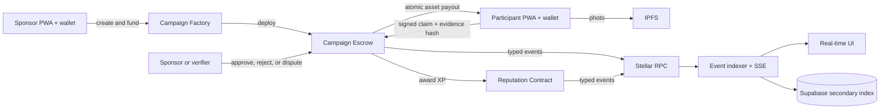

# Level 4 Idea Submission

## Submission Details

- **Project:** JELAJAH
- **Proposed product:** Proof-of-Presence Rewards Network
- **Submission period:** Active August Challenge
- **Current baseline:** Level 3 Testnet prototype
- **Development status:** Proposed Level 4 work will begin only after approval from the Stellar Builder Team.

## Question 1 — What is your idea?

### JELAJAH — Proof-of-Presence Rewards Network

JELAJAH is a location-based rewards platform that enables merchants, event organizers, tourism communities, and social organizations to create real-world missions backed by transparent on-chain rewards.

### 1. Problem Statement

Organizations often want to reward actions such as visiting a local business, attending an event, exploring a tourism destination, or completing a community task. Existing loyalty and campaign systems usually depend on closed databases, manual verification, delayed payouts, and platform-specific points.

Participants cannot independently verify whether a reward pool is funded or whether a payout will be made. Sponsors also have limited transparency over campaign completion and reward distribution.

JELAJAH solves this by allowing sponsors to publish location-based quests and lock the reward budget in a Stellar smart-contract escrow. Participants complete a quest, submit location and photo evidence, and receive the reward after verification or an authorized timeout flow. The contract makes the reward budget, campaign state, and settlement independently verifiable.

The existing JELAJAH Level 3 prototype already demonstrates Testnet escrow, GPS and photo claims, atomic XLM payouts, on-chain reputation, inter-contract communication, and real-time Soroban events. The proposed Level 4–7 work will turn this prototype into a focused, production-oriented rewards platform.

### 2. Why Stellar?

Stellar is suitable because JELAJAH requires low-cost, fast, and transparent reward distribution. Sponsors may need to create many relatively small payouts, where high transaction fees would make the product impractical.

Soroban enables programmable campaign escrow, claim state machines, disputes, timeout-based settlement, replay protection, and atomic communication between campaign, payout, and reputation contracts.

JELAJAH will initially support XLM and Stellar assets such as USDC through Stellar Asset Contracts. In a future Mainnet version, JELAJAH can integrate with an existing compliant Stellar anchor so sponsors can fund campaigns using fiat and participants can access supported on/off-ramp options. JELAJAH will integrate with regulated providers rather than operate as an anchor itself.

Stellar also allows every campaign funding and payout transaction to remain verifiable without making the application database the source of truth.

Relevant Stellar resources:

- [Stellar payments](https://stellar.org/use-cases/payments)
- [Stellar anchors](https://stellar.org/learn/anchor-basics)
- [Stellar on and off-ramps](https://stellar.org/use-cases/ramps)
- [Stellar asset tokenization](https://stellar.org/use-cases/tokenization)

### 3. Target Users

The initial target users are:

- Local merchants running store-visit and promotional campaigns.
- Event organizers rewarding attendance or activity completion.
- Tourism and local communities creating exploration trails.
- Campus and Web3 communities running educational quests.
- Participants who want to discover locations and earn transparent digital rewards.

The first pilot will focus on small community events and local merchants, where campaign results can be measured directly.

### 4. Technical Architecture

The frontend will be a mobile-responsive Next.js PWA with Stellar wallet integration, maps, GPS validation, camera and photo submission, campaign discovery, claim status, and real-time transaction feedback.

The Soroban architecture will consist of:

- A Campaign Factory that deploys individual campaign escrow contracts.
- Campaign Escrow contracts that hold XLM or supported Stellar assets.
- A Reputation contract that awards non-transferable experience after successful settlement.
- A verification and dispute module for approvals, rejections, timeout release, and refunds.
- Typed contract events for campaign creation, claims, disputes, payouts, and reputation updates.

The data flow will be:

1. A sponsor connects a wallet and creates a campaign.
2. The wallet signs a transaction that deploys and funds the campaign escrow.
3. A participant visits the location and submits signed GPS and photo evidence.
4. The photo is stored off-chain through IPFS, while its hash is referenced by the claim.
5. The sponsor or authorized verifier reviews the claim.
6. The escrow contract atomically pays the participant and updates reputation.
7. A Soroban RPC event indexer streams confirmed events to the UI.
8. Supabase stores a retryable secondary index, while Stellar remains the canonical settlement source.

GPS data cannot be proven directly by a blockchain. The MVP will therefore combine geofence checks, signed submissions, timestamped evidence hashes, organizer review, disputes, and timeout rules. A future version will research independent location attestations without claiming that browser GPS alone is trustless.

### 5. Complexity Evaluation

The main technical challenges are:

- Secure multi-contract communication and authorization.
- Supporting multiple Stellar assets in escrow.
- Preventing replay, duplicate settlement, and unauthorized payouts.
- Handling disputes, deadlines, refunds, and automatic release.
- Reconciling off-chain evidence with canonical on-chain state.
- Building a resumable and idempotent real-time event indexer.
- Protecting user privacy by avoiding raw GPS and photo storage on-chain.
- Providing reliable mobile wallet, loading, recovery, and error states.
- Testing contract invariants and complete frontend transaction flows.
- Preparing reproducible CI/CD, contract deployment, monitoring, and migration workflows.

### 6. Roadmap

#### MVP

Complete the Testnet campaign lifecycle with XLM and USDC escrow, mobile quest discovery, evidence submission, verification, disputes, timeout settlement, reputation, real-time events, contract tests, frontend tests, and deployment documentation.

#### User Acquisition

Run small pilots with local merchants, campus communities, tourism groups, and event organizers. Use QR onboarding, sponsored campaigns, referral quests, and reputation-based progression. Measure campaign creation, completion rate, payout success, repeat participation, and sponsor retention.

#### Mainnet Vision

Before Mainnet, complete an independent security audit, improve location attestation, add rate limiting and observability, formalize moderation and dispute operations, and establish backup and recovery procedures. The Mainnet product will support stable-value rewards, optional tokenized merchant vouchers, and integration with compliant Stellar anchors for supported fiat funding and withdrawal flows.

JELAJAH's long-term vision is to become an open and verifiable rewards network connecting digital payments with useful actions in real-world communities.

